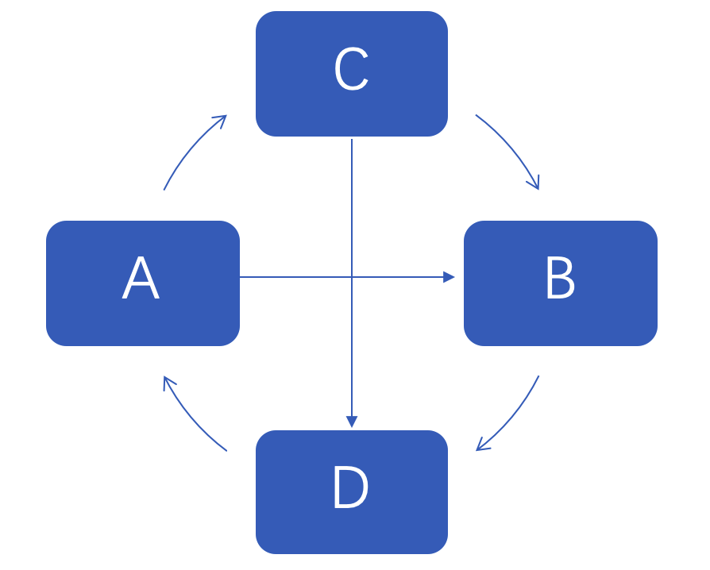

# 容器入门

<!-- toc -->

## 1. 为什么要使用容器

容器可以说是实现控制反转或是依赖注入的工具

实际上，它所带来的好处就是 **解耦合**

没有容器时候，A类需要B类，就去new一个，B类需要C类，也要手动new，往往形成错综复杂的依赖关系



使用容器之后，各个类不直接交互，通过容器来关联，如下


当A类再需要B类时，会向容器申请，容器返回一个B类的实例

可以看到，在这种方式下，各个类耦合度大大降低，有利于系统的维护

## 2. 一个简单的容器实现与使用

只是看上面的介绍还是会认为容器、依赖注入这些概念过于抽象，其实实现一个最简单的容器不过30行代码

结合我们平常的业务场景，下面的示例演示了一个最简单的容器的实现与使用

```php
<?php

class Container
{
    private function getInstance($class_name)
    {
        $params = $this->getConstructParams($class_name);
        return (new ReflectionClass($class_name))->newInstanceArgs($params);
    }

    public function make($class_name)
    {
        $instance = $this->getInstance($class_name);
        return $instance;
    }

    private function getConstructParams($class_name)
    {
        $class = new ReflectionClass($class_name);

        $paramsArr = [];

        $construct = $class->getConstructor();
        $params = $construct->getParameters();
        foreach ($params as $key => $param) {
            $paramsArr[] = $this->getInstance($param->getClass()->getName());
        }
        return $paramsArr;
    }
}

class Controller
{
    protected $service;

    public function __construct(Service $service)
    {
        echo 'controller中的service注入成功'. PHP_EOL;
        $this->service = $service;
        echo 'Controller类新建成功'. PHP_EOL;
    }
    
    public function hello()
    {
        $this->service->hello();
    }
}

class Service
{
    protected $dal;

    public function __construct(Dal $dal)
    {
        echo 'service中的dal注入成功'. PHP_EOL;
        $this->dal = $dal;
        echo 'service类新建成功'. PHP_EOL;
    }

    public function hello()
    {
        $this->dal->hello();
    }
}

class Dal
{
    public function __construct()
    {
        echo 'dal类新建成功'. PHP_EOL;
    }

    public function hello()
    {
        echo 'hello world'. PHP_EOL;
    }
}

$app = new Container;
$controller = $app->make(Controller::class);
$controller->hello();
```

可以把这段程序拷贝到 1.php 文件当中并执行命令

```shell
php 1.php
```

输出结果如下

```php
dal类新建成功
service中的dal注入成功
service类新建成功
controller中的service注入成功
Controller类新建成功
hello world
```
## 3. SPAPHP框架当中的Container容器

SPAPHP框架容器实现在 spaphp/framework/src/container/Container.php 当中

其核心的自动注入功能类似于上面的简单实现，只是多了 **一些属性与辅助方法** ，从而使得自动注入功能更加灵活方便了

下面首先介绍Container容器的使用方法，再来讨论它的实现

### 3.1 容器的使用

容器提供了两个基本功能，**绑定** 与 **解析**，但是在上面的实现中，并没有看到有绑定这个过程，我们是直接这样创建类的

```php
$controller = $app->make(Controller::class);
```

这是因为Controller::class这个类就是一个实体类，直接创建它自身就可以了

如果是下面这种场景呢

```php
$controller = $app->make(IController::class); // IController接口有 ControllerA 和 ControllerB 这两种实现
```

这时容器不知道要创建哪个具体类来实现这个接口，所以我们要提前告诉容器，**需要IController接口时给一个ControllerA(或者B)实现**，而这就是 **绑定**

#### 3.1.1 绑定

绑定就是把接口或抽象类绑定到一个具体的实现上（实体类或是闭包函数）

这里注意，绑定到闭包函数时，解析时所得到的是闭包函数的返回值而不是闭包函数本身

看下SPAPHP的容器提供了哪些绑定方式($app变量就是一个容器类)

**接口绑定**

```php
$app->bind(IController::class, Controller::class);
```

这种绑定方式把某个接口或是抽象类绑定到实现类上

**默认绑定**

对于一个实体类来说，可以认为已经进行了如下的绑定

```php
$app->bind(Controller::class, Controller::class);
```

**实例绑定**

```php
$app->instance('HelpSpot\API', new Controller());
```
这里直接绑定接口到一个对象上了

**单例绑定**

```php
$app->singleton('HelpSpot\API', function ($app) {
    return new HelpSpot\API($app->make('HttpClient'));
});

或者这样写

$app->bind('HelpSpot\API', function ($app) {
    return new HelpSpot\API($app->make('HttpClient'));
}, true);
```
这里注意，不是单例或者实例绑定的话，每次解析类的时候容器都是创建一个新的对象

**上下文绑定**

```php
$app->when(A::class)
          ->need(B::class)
          ->give(function () {
              return new B1();
          });
```
上下文绑定直接根据方法调用链就可以得知用法了，当 **A类** 需要一个 **B接口** 时，就给一个 **B1实现类**

你甚至可以这样来绑定一个数值来帮忙完成类的初始化

```php
$app->when('App\Http\Controllers\UserController')
          ->need('$item')
          ->give($value);
```

当UserController类初始化时，如果有$item这个参数，就给一个$value值初始化$item参数

#### 3.1.2 解析

完成绑定后，类的解析用法就比较简单了

通常是这样进行

```php
$api = $app->make(Controller::class);
```

复杂一点时, 如果Controller::class构造器还要$item这个参数，可以这样

```php
$api = $app->make(Controller::class, ['item' => 100]);
```

或者像上下文绑定时就给出值

```php
$app->when(Controller::class)
          ->need('$item')
          ->give(100);

$api = $app->make(Controller::class);
```

### 3.2 容器实现的一些细节

**注意，如果你只打算使用容器的功能的话，这一小节可以跳过**

这里对Container类当中的一些重要的属性和方法进行说明，阅读Container类的源码时，了解了这些属性和方法的作用，就会轻松不少

#### 3.2.1 基础属性

**数组$aliases与$abstractAliases**

别名机制是容器当中的一个十分重要的机制

你可能会看到这样的用法，这里其实就用到了别名机制

```php
$app->make('ads')
```

在 vendor/spaphp/framework/src/Application类(这其实就是一个Container类)中注册了一些别名如下

```php
$this->aliases = [
    ContainerInterface::class => 'app', // ContainerInterface类别名到‘app’
    IContainer::class => 'app',
    Container::class => 'app',
    Application::class => 'app',
    IRepository::class => 'config',
    Repository::class => 'config',
]
```

与$aliases成对的是$abstractAliases，这个数组在上下文查找时会用到

```php
$this->$abstractAliases = [
    'config' => [
        IRepository::class,
        Repository::class
    ],
    'app' => [
        ContainerInterface::class,
        IContainer::class,
        Container::class,
        Application::class,
    ],
]
```

有了这些别名以后，先进行绑定

```php
$app->bind('app', new Controller());
```

绑定后，下面这些解析全都是拿到Controller这个对象了

```php
$app->make(ContainerInterface::class);
$app->make(IContainer::class);
$app->make(Container::class);
$app->make(Application::class);
$app->make('app');
```

**数组$bindings**

$bindings这个数组存的就是别名到实现的绑定了，结合上面说的别名机制以及$alias数组

如果执行

```php
$app->bind(IContainer::class, Container::class);
```

那么$bindings的内容如下

```php
$bindings = ['app' => Container::class];
```

**数组$instances**

$instances数组存储的是已经实例化出来的对象，单例绑定或者实例绑定其都是依赖于这个数组存储映射的，数组内容和$bindings数组类似
 
**数组$context**

$context存储的就是上下文绑定信息了，

如下

```php
$context = [
    A::class => [
        B::class => B1::class
    ]
]
```

代表的就是

```php
$app->when(A::class)->need(B::class)->give(B1::class);
```

的执行结果

**数组$buildStack与$paramStack**

A类依赖B类，B类依赖C类时，如果解析A类的话，解析过程就是一个递归的过程了

$buildStack和$paramStack分别为递归过程中的类提供上下文查询与传递参数的功能

更具体的可以阅读Container类的build方法实现

#### 3.2.2 基础方法

**build**

下面是build方法的部分源码，去掉了一些辅助部分

```php
public function build($impl)
{
    $reflector = new ReflectionClass($impl);

    $constructor = $reflector->getConstructor();

    $dependencies = $constructor->getParameters();

    $instances = $this->fireDependencies($dependencies);

    return $reflector->newInstanceArgs($instances);
}
```

可以对比一下Container类的build方法与第二节中介绍的简单容器的getInstance方法

这两个方法的功能其实是一样的，都是利用反射递归构造类的实例，在这个过程中实现了自动注入

## 4. 基于SPAPHP框架的应用架构

基于SPAPHP框架搭建的应用大体结构如下


对外，框架提供了一个Application类，它本身就是一个容器(继承自Container类)，同时还注册了一些基础的服务到容器中，应用只要创建这个Application类就可以利用到框架提供的各种能力了

同时，每个应用可以根据自身需要添加拦截器、路由表以及其他服务

**这里注意**

图中所示的服务提供者注册是框架提供的一种机制，这种机制可以方便你注册项目所需的第三方组件到Application类当中，可以参考 src/provider/ 下的AppServiceProvider类的写法


