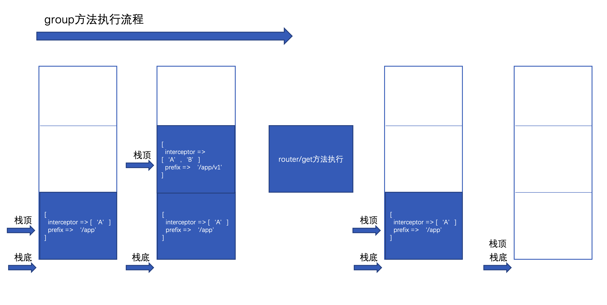

# 路由篇

<!-- toc -->

## 1. 路由的作用

路由是框架当中很关键的一个组件了，它的作用是定义了url到实际控制器方法的一个映射

## 2. SPAPHP路由的使用

路由器支持3种模式的路由写法

### 2.1 基于配置的

```php
<?php
// 简写方式
$router->get('/', 'IndexController@index');
$router->post('/test', 'TestController@store');

// 完整方式，等同于第一条路由规则
$router->addRoute('GET', '/', 'IndexController@index');

// facade 模式
Router::get('/', 'IndexController@index');
Router::post('/test', 'TestController@store');
Router::addRoute('GET', '/', 'IndexController@index');
```

### 2.2 基于rest的

```php
<?php

// 实例模式
$router->rest('/photo', 'TestController');

// facade 模式
Router::rest('/member', 'MemberController');

```

> REST 对应关系

METHOD      |URI                     |响应
---|---|---
GET	        |/photo	                |index
GET	        |/photo/create	        |create
POST	    |/photo	                |store
GET	        |/photo/{photo}	        |show
GET	        |/photo/{photo}/edit	|edit
|PUT/PATCH	|/photo/{photo}	        |update
DELETE	    |/photo/{photo}	        |destroy

### 2.3 基于规则的

```php
<?php
// facade 模式
Router::regexp('/v1/{controller}/{action}', function($controller, $action){
    return $controller . 'Controller@'.$action;
});

// 实例模式
$router->regexp('/v1/{controller}/{action}', function($controller, $action){
    return $controller . 'Controller@'.$action;
});

```

### 2.4 路由组的用法

前面介绍了单条路由的定义规则，在实际中，常常使用SPAPHP框架提供的路由组功能，将有关联的路由规则放在一起定义

路由组有如下这些属性

- prefix，请求路径前缀
- namespace，控制器方法的前缀
- interceptor，路由组拦截器

```php
$router->group([
    'namespace' => 'app\\controller',
    'prefix' => '/app',
    'interceptor' => [
        A::class,
    ],
], function ($router) {
    $router->get('/domain/check', 'domain\\impl\\Domain@check');
    $router->post('/login', 'login\\impl\\LoginImpl@login');
    ...
});
```

上面这样的定义相当于定义了下面这两条路由

```php
$router->get('/app/domain/check', 'app\\controller\\domain\\impl\\Domain@check', A::class);
$router->post('/app/login', 'app\\controller\\login\\impl\\LoginImpl@login', A::class);
```

当你的业务有很多的路由规则时，还可以使用路由组的递归定义功能

```php
$app->router->group([
    'prefix' => '/app',
    'interceptor' => [
        'app\interceptor\Example1',
    ],
], function ($router) {
    $router->group([
        'prefix' => '/a1',
        'interceptor' => [
            'app\interceptor\Example11',
        ],
    ], function ($router) {
        $router->get('/b1', Closure A);
    });
    $router->group([
        'prefix' => '/a2',
        'interceptor' => [
            'app\interceptor\Example12',
        ],
    ], function ($router) {
        $router->get('/b1', Closure B);
    });
});
```

只要记住，当前层级的路由组属性是会和上一层级路由组属性合并就不难理解上面写法所代表的意思了

### 2.5 静态路由与动态路由

SPAPHP当中支持两种路由形式，分别是静态路由与动态路由

静态路由

```php
Router::get('/', 'IndexController@index');
```

动态路由

```php
$router->regexp('/v1/{controller}/{action}', function($controller, $action){
    return $controller . 'Controller@'.$action;
});
```

或者等价于

```php
$router->get('/v1/{controller}/{action}', [
        'callback' => function($controller, $action){
            return $controller . 'Controller@'.$action;
        },
    ]);
```

动态路由可以根据你的实际请求再生成对应的路由规则，比如请求路径为 /v1/ClassA/methodA 时，相当于生成了下面这条路由

```php
$router->get('/v1/classA/methodA', 'ClassAController@methodA');
```

在SPAPHP框架中，静态路由分发过程直接查找路由表，动态路由借助了 nikic/fast-route 这一组件进行分发

## 3. SPAPHP路由的实现

路由组件的实现在 vendor/spaphp/framework/src/routing 目录下，主要是Router类与Route类

这两个类之间的关系好比 **路由器** 与 **具体一条路由规则**

Router类负责路由规则的添加与分发，Route记录了具体路由规则方法、拦截器、参数是什么

为了阐述清楚SPAPHP路由组件是如何实现的，还是通过一个实例来说明

### 3.1 路由规则添加

我们先来定义如下这条路由

```php
$app->router->group([
    'prefix' => '/app',
    'interceptor' => [
        'A',
    ],
], function ($router) {
    $router->group([
        'prefix' => '/v1',
        'interceptor' => [
            'B',
        ],
    ], function ($router) {
        $router->get('/{foo}/{bar}', [
            'callback' => function ($foo, $bar) {
                return 'spaphp\\' . $foo . 'Controller@' . $bar;
            },
        ]);
    });
});
```

首先进入的就是Router类的group方法了

```php
public function group(array $attributes, Closure $callback)
{
    if (isset($attributes['interceptor']) && is_string($attributes['interceptor'])) {
        $attributes['interceptor'] = explode('|', $attributes['interceptor']);
    }
    $this->updateGroupStack($attributes);
    call_user_func($callback, $this);
    array_pop($this->groupStack);
    return $this;
}
```

在上面所给的示例中，这个方法的执行流程如下图所示

在这一执行流程中，最终目的是执行router/get这句来添加路由规则，为了添加路由的功能更强大，引入了栈来支持递归



图中所画的栈就是Router类的$groupStack属性，理解这个属性所起到的作用，整个路由组件的工作机制也就基本清楚了，下面再看下 router/get 方法的过程

```php
public function get(string $uri, $action, $interceptor = null)
{
    $this->addRoute(['GET', 'HEAD'], $uri, $action, $interceptor);
    return $this;
}
```

可以看到，添加get方法时实际还会再默认支持HEAD方法，再看下 router/addRoute 方法

```php
public function addRoute($method, string $uri, $action, $interceptor = null)
{
    $action = $this->formatAction($action, $interceptor);
    $attributes = [];
    if (!empty($this->groupStack)) {
        $attributes = $this->mergeWithLastGroup([]);
    }
    if (isset($attributes['prefix'])) {
        $uri = $attributes['prefix'] . $uri;
    }
    $action = $this->mergeGroupAttributes($action, $attributes);
    // 添加路由规则
    if (is_array($method)) {
        foreach ($method as $verb) {
            $this->routes[$verb . $uri] = [$verb, $uri, $action];
        }
    } else {
        $this->routes[$method . $uri] = [$method, $uri, $action];
    }
    return $this;
}
```

这个方法所做的工作是借助于前面所说的$groupStack属性完成对当前这条路由规则 执行方法、完整请求路由、拦截器的记录（存储到了routes属性当中）

打印出路由规则如下

```php
[
    [0]=> "GET",
    [1]=> "/app/v1/{foo}/{bar}",
    [2]=> [
        ["callback"]=> function ($foo, $bar) {...}
        ["interceptor"]=> [
            A,
            B,
        ]
    ]
]
```

到此，一条新的路由规则添加完成

### 3.2 路由分发

当请求 /app/v1/Hello/method 这个路径时，会由 RouteRequest/dispatch 进入到 Router/dispatch 方法当中

```php
public function dispatch(string $method, string $uri): Route
{
    if (isset($this->routes[$method . $uri])) { // 静态路由查表
        return new Route($this->app, $this->routes[$method . $uri][2], []);
    }
    $routeInfo = $this->dispatcher()->dispatch($method, $uri); // 借助nikic/fast-route的动态路由分发
    switch ($routeInfo[0]) {
        case FastRoute\Dispatcher::NOT_FOUND:
            throw new NotFoundException(); // 这里返回 'NOT FOUND' 字符串
            break;
        case FastRoute\Dispatcher::METHOD_NOT_ALLOWED:
            $allow = $routeInfo[1];
            throw new MethodNotAllowedHttpException($allow); // 这里返回 'METHOD NOT ALLOWED' 字符串
            break;
        case FastRoute\Dispatcher::FOUND: // 动态路由查找成功
            $handler = $routeInfo[1];
            $vars = $routeInfo[2];
            break;
    }
    return new Route($this->app, $handler, $vars);
}
```

这里返回了Route对象，这个对象的handler属性与$vars属性值如下

```php
$handler = [
    'callback' => function ($foo, $bar) {...}
    'interceptor' => [
        A,
        B,
    ],
];
$vars = [
    'foo' => 'Hello',
    'bar' => 'method'
];
```

在 RouteRequest/dispatch 中接收到刚刚返回的Route对象

```php
protected function dispatch(Request $request = null, Response $response = null)
{
    ...
    // 1. 这里接收到Route对象
    $route = $router->dispatch($request->getMethod(), $request->getPathInfo());
    $request->currentRoute($route);
    $attributes = $route->getAttributes();
    $request->add($attributes);

    $routeInfo = [
        $route->getAction(), // 2. 这里得到Route中记录的要执行的方法或是闭包 
        $attributes, // 这里就是上文的$vars变量，动态路由参数
    ];

    $interceptor = array_unique(array_merge($this->interceptor, $route->getInterceptor())); // 3. 全局拦截器与路由拦截器合并
    if (count($interceptor) > 0) {
        $response = (new PipeLine($this))
            ->send($request)
            ->through($interceptor)
            ->then(function ($request) use ($routeInfo) {
                return $this->runRoute($routeInfo); // 4. 执行路由方法
            });
    } else {
        $response = $this->runRoute($routeInfo);
    }
    return $response;
}
```

再看下其中的 Route/getAction 方法

```php
public function getAction()
{
    if (isset($this->handler['callback'])) {
        return $this->app->call($this->handler['callback'], $this->vars);
    }
    ...
    throw new \RuntimeException('handler does not set right.');
}
```

对于示例中的情况，执行了以下闭包 ($foo = 'Hello', $bar = 'method')

```
function ($foo, $bar) { 
    return 'spaphp\\' . $foo . 'Controller@' . $bar;
}
```

返回了 'spaphp\HelloController@method' 这个要执行的类方法

最终的执行 runRoute 利用了容器提供的方法调用功能

```php
protected function runRoute(array $routeInfo)
{
    ...
    list($class, $method) = explode('@', $action);
    $instance = $this->make($class);
    if (method_exists($instance, $method)) {
        return $this->call([$instance, $method], $params); // 容器的方法调用功能
    }
}
```


